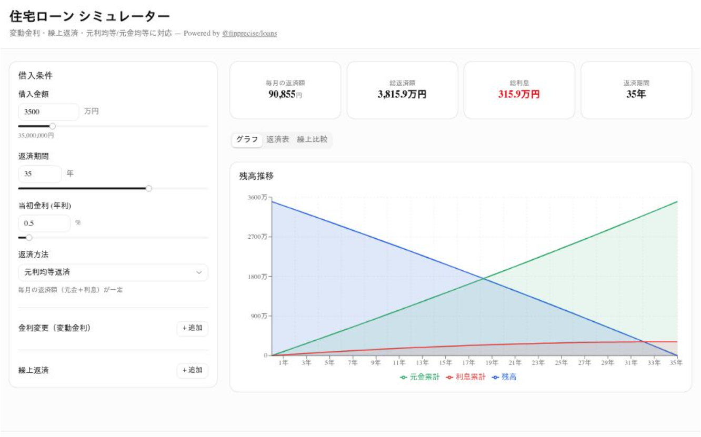

# finprecise-loan-simulator

> **デモ:** https://finprecise-loan-simulator.vercel.app/

[@finprecise/loans](https://github.com/yasu/finprecise) を使った住宅ローンシミュレーター。
任意精度演算による正確な返済計算を、直感的な UI で体験できます。



## 機能

- **元利均等 / 元金均等** — 返済方法を切り替えて比較
- **変動金利** — 任意のタイミングで金利変更ステップを追加
- **繰上返済** — 期間短縮型・返済額軽減型に対応、あり/なし比較表示
- **返済スケジュール表** — 年次/月次切替、ページネーション付き
- **残高推移グラフ** — 残高・元金累計・利息累計を可視化
- **URL 共有** — 入力条件が URL パラメータに反映され、リンクで共有可能

## 技術スタック

- [Next.js](https://nextjs.org/) (App Router)
- [@finprecise/loans](https://github.com/yasu/finprecise) — 任意精度ローン計算エンジン
- [Tailwind CSS](https://tailwindcss.com/)
- [shadcn/ui](https://ui.shadcn.com/)
- [Recharts](https://recharts.org/) — グラフ描画

## セットアップ

```bash
npm install
npm run dev
```

http://localhost:3000 でアクセスできます。

## テスト

```bash
npm test
```

## ビルド・デプロイ

```bash
npm run build
```

Vercel にデプロイする場合は、リポジトリを接続するだけで自動的にビルドされます。

## @finprecise との関係

このプロジェクトは [@finprecise/loans](https://github.com/yasu/finprecise) のデモアプリケーションです。
`@finprecise/loans` は npm パッケージとして依存しており、monorepo の一部ではありません。

計算ロジックはすべて `@finprecise/loans` の `loanSchedule()` 関数に委譲しています。
本アプリの [`lib/calculate.ts`](lib/calculate.ts) は UI とライブラリを繋ぐ薄いラッパーです。

## ライセンス

MIT
